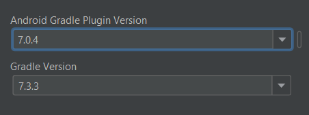
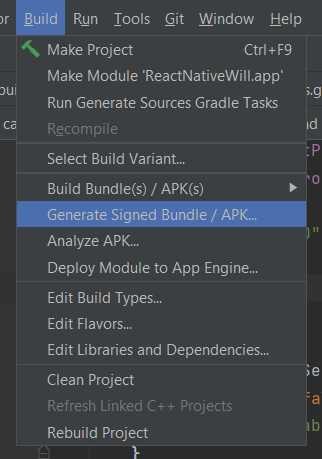
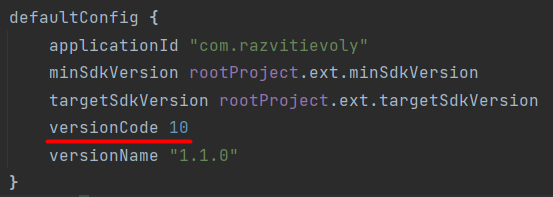
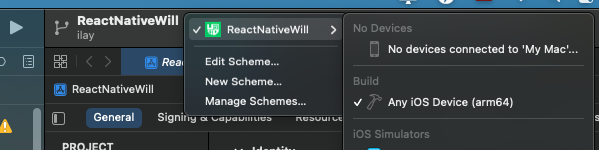

# Инструкция
## Версия nodejs
* 14.19.1
## Ветки
* develop - актуальная рабочая версия
* session - законченная версия приложения для сессий
* one-task - законченная версия с возможностью создать одно дело
* master - не используется
* Остальное - личные ветки разработчиков

По завершению дня запулить все изменения со своей ветки в ветку develop для поддержания актуальной версии.

## Настройка рабочего окружения
Перед тем как запустить проект, надо настроить рабочее окружение
* [Linux](https://www.jscamp.app/ru/docs/reactnative16/)
* [MacOS](https://www.jscamp.app/ru/docs/reactnative15)
* [Windows 10](https://www.jscamp.app/ru/docs/reactnative14)

## Запуск проекта
    npm run start
И в отдельном терминале для android

    npm run android

и для ios

    npm run ios

## Ошибки
Скорее всего при первом запуске у вас будут ошибки. Зачастую они связаны с настройкой окружения.

### Android
* Проверьте версии Android Gradle(7.0.4) и Gradle Version(7.3.3)

Не забудьте после смены версии почистить кэш и удалить все прошлые версии Gradle из директории.
Для более подробной информации смотреть [сюда](https://www.tehrir.com/gradle-sync-failed)

### IOS 
На старте проекта надо скачать зависимости для ios
    
    cd ios

    pod install
Проблемы могу быть на ровном месте, так что тут только гуглить ошибки.

## Публикация

### Android

Чтобы сделать сборку для публикации надо в **Andoid Studio** открыть папку **android** и после во вкладке **Build** нажать **Generate Signed Bundle or APK**

 
Для публикации выбираете **Android App Bundle** заблаговременно увеличив версию приложения в файле **build.gradle**

Далее нужно указать ключ. Без него опубликовать приложение невозможно.
Ключ хранится в папке key. Пароль: 123edcxzaq

### IOS 
* Открыть с помощью Xcode файл с расширением xcworkspace в папе ios.
* Убедиться, что схема сборки архива выбрана для релиза
Xcode => вкладка Product => Scheme => Edit Scheme
* Поменять версию сборки
* Выбрать в цели сборки любые девайсы 
* вкладка Product => Archive

